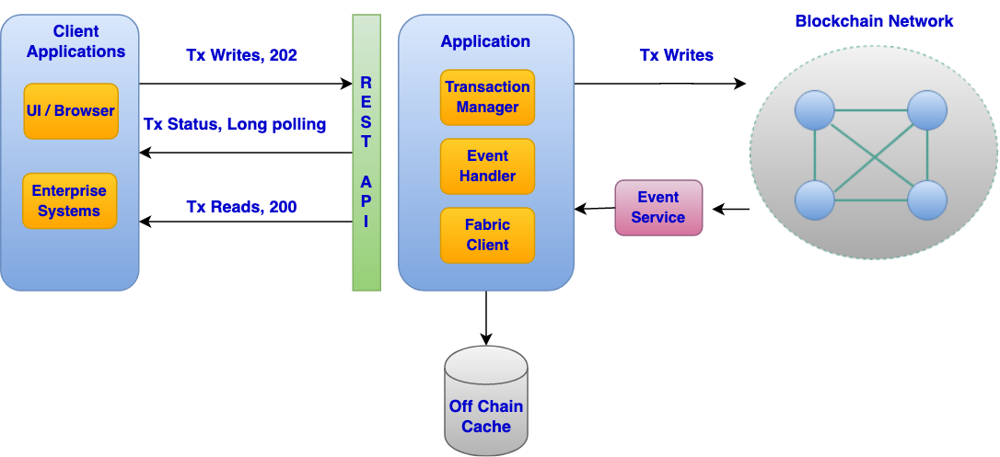

# Async API Pattern

## Overview

This design pattern is a logical continuation of the non-blocking UI design pattern. It represents the second part of the Blockchain design pattern series. The non-blocking UI pattern touched upon the role of the asynchronous RESTful API and how it fits into the end to end architecture of a distributed blockchain application. This part will dive deeper into the asynchronous backed API and discuss the API design and its interaction with other components such as off chain store and the events service. This design pattern uses Hyperledger Fabric 1.4 as its Blockchain reference.


## Problem Statement

In traditional applications when the user makes an API request such as creating a new resource, the user generally makes a blocking call to a backed API. Upon completion of the API request, the user receives the appropriate response payload based on whether the request was successful or not. Normally this model works quite well assuming the backend API has a fast response time. But when dealing with certain Blockchain based applications we cannot expect millisecond response times (As per current level of maturity). Listed below are some considerations that are relevant for complex enterprise grade Blockchain based applications.

### User interaction with the API
Suppose a user creates a request for generating an invoice and submits it via the API  interface. The invoice content needs to be stored on the Blockchain. At the very minimum the backend application would need to perform the following operations
* Send transaction proposals and fetch the corresponding endorsements
* Submit the transaction proposal responses to the orderer(s)
* Wait for a Block/Chaincode event from the event service
* Return the appropriate success/failure response to the user interface

During this time the user is <strong>blocked</strong> waiting for the invoice creation request to complete.

The scenario above is a simplification. Production grade microservices based solutions are quite complex and additionally need to account for the following
* Microservices architecture leading to multiple network calls
* Retries owing to MVCC (Multi version concurrency control) errors from the Blockchain
* Distributed transactions across services
* Resiliency/Recovery scenarios leading to multiple retries for network/connectivity errors
* Network latency

All the factors above along with Blockchain’s transaction paradigm, which includes asynchronous transaction submission make for a fairly complex backend API with a high response time.

### What the user wants?
* Ideally, dealing with synchronous/blocking APIs makes for simpler client applications. The user’s client application makes an API request and receives a response indicating whether the request was successful or not along with the appropriate response payload. But when dealing with complex APIs that have higher response times, a blocking implementation can hamper performance due to resources being tied up waiting for dependent tasks to complete.
* For UI clients the asynchronous API is quite useful as demonstrated in the non-blocking UI design pattern

### What the API developer wants?

* The API developer wants to provide a stable and fast experience to the API consumer.
* For APIs with high response times implementing a blocking request/response paradigm does not make sense. The resources on the API server are blocked waiting for other asynchronous tasks to complete (E.g a thread serving the API request is blocked waiting for Blockchain interaction to complete)


## Architecture Diagram

The diagram below shows the different components of a Blockchain based application. This pattern will cover the design of the application layer and its interaction with the off chain cache, event service and the Blockchain.

&ensp;

<figure>
<html>
<head>
<meta name="viewport" content="width=device-width, initial-scale=1">
</head>
<body>

</body>
</html>
<figcaption>Fig.1</figcaption>
</figure>

&ensp;

The architecture above covers one possible approach for designing a distributed application that talks to Blockchain and caters to user interface requests. The next section will dive deeper into each of the components.


## Solution

### RESTful API

This pattern takes the example of RESTful communication to demonstrate how the asynchronous backend API layer can be designed. Other options such as web sockets, gRPC etc could also be used to implement the communication between the client and server/APIs, but these will covered in subsequent iterations of this pattern.

* The API layer needs to support asynchronous request execution so as to respond to the client immediately with transaction/request information for further reconciliation.

* The client can poll the transaction endpoint or be notified via a webhook or message queue of the status of the transaction.

* The API layer will make use of an off chain persistence store that will be used to replicate the data on the Blockchain for faster and more efficient querying

* The API layer will leverage the events service to be notified of new blocks being added to the Blockchain.

* These block events will be used to reconcile the state of the transactions invoked via the application and also to update its off chain persistence with the data that was added to the world state as a part of these block commits.

##### Endpoints

#### POST / invoices

Sample endpoint for creating an invoice resource using the RESTful API exposed by the application layer. Shown below is a sample response from the said API capturing the resource id, which in this case is the invoice id and the transaction id, which can be leveraged to poll the transactions endpoint for transaction status

```
Response Status: 202, Accepted

Response payload:

{

	"invoiceId": "invoice123",
	"transactionId": "tx123"
}
```

#### GET /transactions?invoiceId=invoice123&status=Completed

Sample endpoint for fetching all transactions invoked by a specific entity, for e.g a specific organization or user etc. The endpoint can have optional query parameters to filter the transaction list by the resource/object on which it acted and or status etc. By providing the invoiceId as a query parameter the caller can fetch all the transactions related to that particular invoice

```
Response Status: 200, Ok

Response payload:

[{
		"transactionId": "tx123",

		"progress": {

			"status": "InProgress | Completed | Failed",
			"message": "helpful message for the user"

		},

		"objectId": "invoice123",

		"objectType": "invoice",

		"action": "create"

	},

	{

		"transactionId": "tx456",

		"progress": {

			"status": "InProgress | Completed | Failed",

			"message": "helpful message for the user"

		},

		"objectId": "invoice123",

		"objectType": "invoice",

		"action": "update"

	}

]

```

#### GET /transactions/{id}

The sample endpoint can be used for fetching a specific transaction using its transaction id. The client can poll this endpoint to figure out the status of a particular transaction using the transaction id that was returned as a part of the create resource/invoice response. The API endpoint could implement HTTP long polling to reduce the network traffic between the client and server. Certain server side runtime environments such as Node.js are more conducive to implement long polling given their inherent asynchronous programming paradigm. Web sockets, gRPC could be other alternatives for implementation.

```
Response Status: 200, Ok

Response payload:

{

		"transactionId": "tx123",

		"progress": {

			"status": "InProgress | Completed | Failed",

			"message": "helpful message for the user"

		},

		"objectId": "invoice123",

		"objectType": "invoice",

		"action": "create"

}

```

### Off Chain Persistence Store

The off chain persistence can be implemented using any mechanism that suits the application’s design and data structures. The design of the off chain cache will be taken up in more detail in the third part of this design pattern series, which will cover the secure sync pattern. The purpose of the off chain store is to be a replica of the data on the Blockchain that is relevant to the owning distributed application/stack. All queries can then be served directly from the off chain store rather than going to the Blockchain directly. This provides faster reads and more powerful search capabilities along with more granular administrative control over the persistence layer.

### Events Service

The event service is meant to listen in for block events from the Blockchain peers and then serve them to the application layer. The design of the distributed event service will be taken up in more detail in the third part of this design pattern series, which will cover the secure sync pattern.

### Interaction Flow

The figure below demonstrates the request execution flow between the different components described above. As mentioned earlier the pattern assumes a RESTful API implementation for the application stack


&ensp;

<html>
<head>
<meta name="viewport" content="width=device-width, initial-scale=1">
</head>
<body>


</body>
</html>

&ensp;


<ol>
<li>The user makes a request to the API for creating a new invoice</li>
<li>The API performs basic validation of the request</li>
<li>Post successful validation the API creates a transaction record in the off chain store to manage the lifecycle of the request. The status of the transaction is set as InProgress</li>
<li>The API layer now submits the transaction proposal for endorsement to the required peer(s)</li>
<li>If the proposal response indicates successful endorsement then the Blockchain transaction Id is updated in the transaction record created in step 3 and a HTTP 202, Accepted response is returned to the user, which contains the invoice and local transaction record id</li>
<li>If the proposal response indicates failure due to chaincode validation errors or other server side errors an appropriate error response is returned to the user with the appropriate HTTP status code</li>
<li>Assuming the user got back a 202 with the transaction id, the user client is now free to start polling the transaction endpoint to check the status of the transaction (GET /transactions/{id})</li>
<li>Any GET calls to the API to fetch the invoice details (GET /invoices/{id}) while the transaction is InProgress or has Failed will result in a 404 HTTP Status code to indicate that the resource being requested does not exist on the server</li>
<li>After returning the success or failure response to the user as indicated in steps 6/7, the API now submits the transaction whose proposal response was received in step 4 to the orderer(s). The API could use a queue to pick up InProgress transactions that need to be moved along in their lifecycle or it could poll the off chain store to fetch the transactions that need to be acted upon. This implementation decision is left to the user</li>
<li>Post submission of the transaction to the orderer(s), the API layer will receive an event corresponding to the said transaction indicating whether it was committed on the Blockchain or not</li>
<li>This event mechanism is managed by the event service component to which the API application is subscribed to</li>
<li>If the transaction was successfully committed then the status of the local transaction record in the off chain store will be updated to Complete</li>
<li>In addition the payload from the transaction event can then be leveraged to update the off chain store with the data that was committed to the Blockchain as a part of this transaction</li>
<li>E.g the invoice object that now resides on the Blockchain would also be stored on the local off chain store. This will enable faster gets and searches of the invoice</li>
<li>A GET /transactions/{id} call  on the API now will indicate that the transaction is Complete</li>
<li>The user can now fetch the invoice data by querying the API endpoint. The API will in turn fetch the invoice from its off chain store rather than going to the Blockchain</li>
</ol>

## Usage/Examples

### Example Implementations
