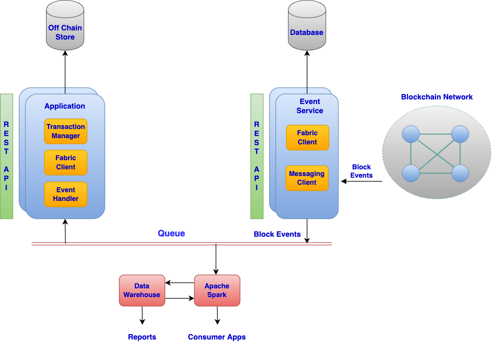

# SecureSync API Pattern

## Overview

This is the third part of the design patterns series. It covers the design of the event service that can be used to securely sync Blockchain with an application’s off chain store. This off chain store can then be leveraged for running functional queries/searches. The event service can also be used as an integration point to setup a data warehouse or provide streaming data as input to a computing framework such as Apache spark for learning and analytics. This pattern will cover the high level architecture of the event service along with the solution.


## Problem Statement

### Transaction lifecycle refresher

Transaction commit on the Blockchain is an asynchronous operation. The client application submits a transaction to the orderer(s), which in turn returns a response indicating a successful submission. But the response from the orderer does not imply that the said transaction has actually been committed on the ledger. The transaction will make its way into a block, which will be distributed to all the peers on the related channel. Each peer will run the validation logic to decide whether the block will be committed on the peer’s ledger or not. Once a block is successfully committed on a peer’s ledger, the peer will emit a block event. The block event will contain information about all the transactions that were included as a part of that block.

### What the application developer wants?

* The client application, which submitted the transaction to the orderer(s) needs to know whether the transaction was committed to the ledger or not

* The client application needs to use complex queries and attribute based search for the data on the blockchain in an efficient and fast manner

* The client application wants to securely extract the data from the Blockchain for learning and analytics in an efficient manner


## Architecture Diagram

The diagram below shows the different components of a Blockchain based distributed application that leverages the event service and how the components interact with each other

&ensp;

<figure>
<html>
<head>
<meta name="viewport" content="width=device-width, initial-scale=1">
</head>
<body>




</body>
</html>
<figcaption>Fig.1</figcaption>
</figure>

&ensp;

The architecture above demonstrates how the event service can be used to publish block events to a queue of choice. These block events can be subsequently picked up by different consumers for functional application integration, learning and analytics. The next section will dive deeper into each of the components.

## Solution

### Event Service

The major responsibilities of the Event service are outlined below

* Registering with and listening in for block events from the channel event service

* Do a possible data transformation on the block events for easier consumer consumption in addition to what filtered blocks provide

* Distribute these events to interested consumers with atleast once delivery semantics

* Be crash fault tolerant and support load balancing on the producer and consumer side


#### Deployment

The event service is meant to be part of a distributed application stack that belongs to a peer owning organization/member. This is in line with the design of other application components so as to avoid point of centralization that gets to see all the events/data on the Blockchain. The event service would be able to listen in for block events on channels that the organization/member is a part of.

#### Registration

The event service could leverage the default registration mechanism provided by the chosen SDK or directly write a gRPC client to interact with the Deliver and DeliverFiltered event services provided by the fabric for a more customized implementation. The block events received from the channel event service could then be transformed or pushed as is on a messaging queue of choice. This design pattern will take Kafka as an example. The event service could expose a set of REST APIs, which could be used for configuring/creating  subscriptions with event services of different channels. Alternately, the event service could read the necessary configuration on start up from traditional config files and go register with the required channel event services.

#### Event Producer

<font color="red">**``<TODO>``** Add more detail on where the data resides in the block event/transaction</font>

As mentioned earlier, once the event service receives block events from the channel event service, it can push these events (with optional transformation) to a messaging queue of choice. For the sake of discussion this pattern will take Kafka as an example.

* The event producer would push the block events to a kafka topic

* This topic can be further subdivided into partitions by whatever partitioning logic suits the application needs. E.g Partitions could be created based on whether the block number is even or odd. Partitions could be created based on chaincodes or chaincode event types etc. The idea is to have a reasonable number of partitions so as to facilitate load balancing when writing to a topic from the producer side

* The topic should have a reasonable replication factor so that the topic data is replicated across multiple kafka brokers

* The event producer should also keep track of the blocks that have been successfully pushed on to the topic. This will help recover from unplanned crashes since the event producer can start processing blocks from where it left off before the crash

#### Event Consumer

Kafka consumer groups can be used to listen in for the block events from the consuming application.

* The consumer group will help facilitate load balancing on the consumer side since each partition will be assigned to one consumer in the consumer group

* In case a consumer crashes, kafka will reassign the partition to a different consumer in the consumer group ensuring that the event gets consumed

* Number of consumers in the consumer group should be less than or equal to the number partitions in the topic being consumed off.

* The consuming application can be horizontally scaled so as to create the targeted number of consumers in a consumer group

#### Delivery Semantics

Exactly once ordered delivery would be the holy grail. But a more practical implementation would be able to achieve at least once unordered delivery semantics. At least once semantics mean that a block event would not be lost but it may be delivered to the consumer multiple times. Unordered delivery means that the block events may reach the consumer out of order. The consuming application would need to handle both these cases

### Consumer Application

The consumer application design was discussed in detail in the second part of the design pattern series, which covered the async API pattern. In a nutshell the application layer is responsible for interacting with the Blockchain for submitting transactions and also providing the API layer for the end consumers to interact with. In addition, the consumer application is also responsible for implementing the client/consumer that can read data/block events off the queue being published to by the event service. The data provided by the event service can then be used to populate the off chain store. This in turn will help create a suitable representation of the data that is available on the ledger. The consumer application can then always directly query the off chain store instead of going to the ledger for fetching the data.

As per the delivery semantics covered earlier, the consumer application would need to take care of the following

<i>Handling duplicate block event delivery</i>

Unless block event processing on the consumer side is important, the consuming application would need to keep track of the blocks it has already consumed. This way the consuming application can ignore any duplicate block events

<i>Handling unordered block event delivery</i>

Here is a sample approach to handle out of order block events. It can be adapted to suit an application’s needs.

For every object/resource that is being acted upon in the chaincode and which will be replicated in the off chain store, the consuming application should maintain the following lookup data

```
{
	"objectId": "obj123",
	"lastBlockSeen": 3
}
```

Every time the consuming application sees a block related to an object, it should update the lookup data to reflect that. The consuming application can decide to process a transaction in the block only if the object being acted upon has not already seen a later block

Now let’s see how this approach pans out with an example scenario. Let us assume that the following transactions were committed on to the ledger

Transaction 1, Block 1: Creates a new object (obj123) on the ledger

Transaction 2, Block 2: Updates the object (obj123) on the ledger

Transaction 3, Block 3: Deletes the object (obj123) on the ledger

Let’s assume the consumer application see’s these blocks in reverse order (3,2,1).

* The consumer application received block 3

* It extracts transaction 3 from the block

* It determines from the transaction payload that the object to be deleted is obj123

* It does a lookup for obj123. There is no entry for this object. This indicates that the object is yet to be created and there is nothing to delete in the off chain store.

* The consumer creates an entry for obj123 indicating that the last block seen is 3

* Now the consumer app receives block 2. It extracts the transaction and determines that object being updated is obj123

* The consumer performs the lookup for obj123 and finds that an operation corresponding to block 3 has already been performed for this object. The consumer application ignores obj123 as a part of block event 2

* Same process is repeated when the consumer application receives block 1

The flowchart below captures the logical flow to follow when the consumer application receives a block event

&ensp;

<figure>
<html>
<head>
<meta name="viewport" content="width=device-width, initial-scale=1">
</head>
<body>


</body>
</html>
<figcaption>Fig.2</figcaption>
</figure>

&ensp;

#### Considerations

* Capture the action being performed (INSERT/UPDATE/DELETE) in the transaction payload or via a chaincode event payload. The consumer app would need to understand the action being performed to handle it appropriately

* In case of an update, make sure to include the whole data object in the transaction payload or chaincode event. This would ensure that if an update transaction is received before an insert transaction, the app can simply create/insert the said object into the off chain store. If the update transaction included only the fields that were updated then the consumer app would not be able to process this update on the off chain store since the insert transaction has not been processed yet.

### Off Chain Persistence Store

The off chain persistence can be implemented using any mechanism that suits the application’s design and data structures. The purpose of the off chain store is to be a replica of the data on the Blockchain that is relevant to the owning distributed application/stack. All queries can then be served directly from the off chain store rather than going to the Blockchain directly. This provides faster reads and more powerful search capabilities along with more granular administrative control over the persistence layer.

#### Considerations

* The off chain store should be distributed and scoped to a distributed application stack and not centralized

* The off chain store is meant to store the data that is relevant to the owning application stack

* All reads via the corresponding application’s stack can now go directly to the off chain storage rather than Blockchain

### Analytics

The data being pushed by the event service can also be used for analytics and learning.

* A dedicated consumer can be used to read data off the queue for analytics and learning purpose

* Assuming the data is in JSON format, the consumer could then transform data into a traditional tabular relational format and store it in a standard RDMS.

* This RDMS could then be used as a source of an ETL process that could load the data into a traditional data warehouse

* The data warehouse could then be used for standard business analytics, visualization, reporting etc

* The data warehouse could also be used as a source for a computing framework such as Apache spark, which could use historical data as a part of its machine learning models

* Another consumer could be used to read the data off the queue and stream it into Apache spark directly as well.

## Usage/Examples

### Example Implementations
