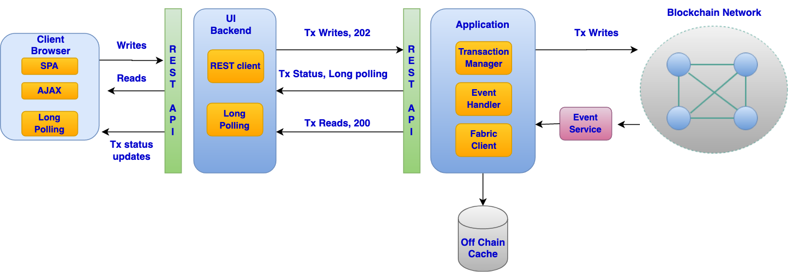
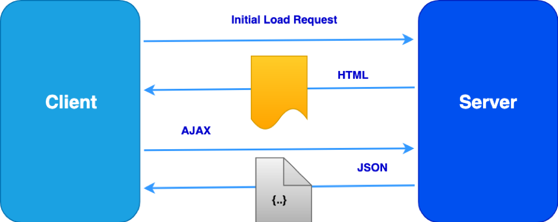
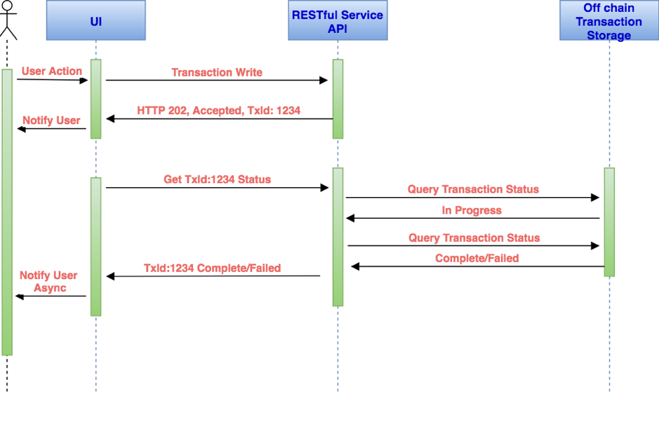

# Efficient UI for Asynchronoous Blockchain Interactions

## Overview

This design pattern starts by taking the reader through the problems that plague a traditional user interface when interacting with a Blockchain based application. The design pattern then presents some key concepts/approaches that can be used to alleviate the problem at hand and follows up by providing an end to end architecture and solution overview of how the different solution components can come together to create a responsive user interface. This design pattern uses Hyperledger Fabric 1.4 as its Blockchain reference.

## Problem Statement

In a traditional user interface when the user performs an action such as submitting a form, the user interface generally makes a blocking call to a backed API. The user generally sees the page refresh or a progress bar to indicate that the operation is in progress. Once the user interface receives a response from the backend API, the appropriate success or failure message is then displayed to the user. Normally this model works quite well assuming the backend API has a fast response time. But when dealing with Blockchain based applications we cannot expect millisecond response times (As per current level of maturity). Listed below are some considerations that are relevant for enterprise grade Blockchain based applications

### User interaction with the UI
Suppose a user fills up an invoice creation form and submits it via the user interface. The invoice content needs to be stored on the Blockchain. At the very minimum the backed application would need to perform the following operations 
* Send transaction proposals and fetch the corresponding endorsements
* Submit the transaction proposal responses to the orderer(s)
* Wait for a Block/Chaincode event from the event service
* Return the appropriate success/failure response to the user interface

During this time the user is <strong>blocked</strong> waiting for the invoice creation request to complete and is watching a progress bar.

The scenario above is a simplification. Production grade microservices based solutions are quite complex and additionally need to account for the following
* Microservices architecture leading to multiple network calls
* Retries owing to MVCC (Multi version concurrency control) errors from the Blockchain
* Distributed transactions across services
* Resiliency/Recovery scenarios leading to multiple retries for network/connectivity errors
* Network latency

All the factors above along with Blockchain’s transaction paradigm, which includes asynchronous transaction submission make for a fairly complex backend API with a high response time.

### What the user wants?
* A fast and responsive UI that does not block the user from interacting with other facets of the user interface while an operation is in progress
* Fast and trusted reads

## Architecture Diagram

HTTP Long polling and websockets are two possible approaches that can be used to implement the communication between the client and the server for this pattern. This design pattern uses the HTTP long polling technique as demonstrated in the architecture below. Part 2 of this pattern will demonstrate the websockets approach

&ensp;

<figure>
<html>
<head>
<meta name="viewport" content="width=device-width, initial-scale=1">
</head>
<body>

</body>
</html>
<figcaption>Fig.1</figcaption>
</figure>

&ensp;

The architecture above covers one possible approach for designing a distributed application that talks to Blockchain and caters to user interface requests. The next section will dive deeper into each of the components.

## Solution

### User Interface

This design pattern will take the example of a web based user interface.
* **SPA (Single Page Application)** with client side MVC: This is a pretty standard way of architecting user interfaces nowadays. Angular JS is a popular framework that is used by UI developers to implement client side MVC pattern. This ensures the burden of view generation is now on the client browser and simplifies the backend APIs to concern itself purely with the data.

* **AJAX**: Asynchronous JavaScript. Again, this is a fairly standard technique used by the client to fetch information from the server in an asynchronous manner in the background. The user can continue to interact with the user interface in the meantime as the entire page need not be refreshed

* **Non-Blocking UI**: The user should not be blocked and made to stare at a progress bar while a request is being processed by the backend APIs. API calls with high response times such as

    * Writes to the Blockchain
    * File uploads etc

Should be asynchronous so as to respond to the client immediately with transaction/request information for further reconciliation

&ensp;

<figure>
<html>
<head>
<meta name="viewport" content="width=device-width, initial-scale=1">
</head>
<body>

</body>
</html>
<figcaption>Fig.2</figcaption>
</figure>

&ensp;

Asynchronous Backend API
In order to implement a non-blocking user interface the backend data APIs need to support asynchronous request execution. The sequence diagram below captures the interaction between the user interface and the server side data APIs

&ensp;

<html>
<head>
<meta name="viewport" content="width=device-width, initial-scale=1">
</head>
<body>

</body>
</html>

&ensp;

<ol>
<li>The user fills up and submits an invoice generation form in the user interface</li>
<li>The user interface sends an AJAX request to the server side REST APIs</li>
<li>The REST API receives the request and performs some basic validations. If the validations were successful the API responds back with a HTTP 202 Accepted response. This response also contains a transactionId. This indicates that the server has accepted the request and is processing it.</li>
<li>The user interface on receiving this response from the server can immediately notify the user that the request for invoice generation is in progress and that the user would be notified once it completes. In the meantime the user is free to interact with the user interface for any other tasks</li>
<li>The user interface now starts polling the server transaction API endpoint with the transactionId as a query parameter</li><strong>(GET ../transactions?transactionId=tx123)</strong>

<li>The server’s transaction API receives this request and starts polling its transaction store for the status of this transaction. The server keeps the connection open till the transaction status has reached a terminal state (Completed/Failed) or if a timeout has occurred. Once the transaction reaches terminal state or timeout occurs the server responds back to the client with the appropriate transaction information, including status. This is essentially long polling</li>
<li>If the user interface receives a transaction failed/completed status from the API then the user interface can notify the user that the invoice has been committed on the Blockchain or in case of failure recommend the appropriate next action</li>
<li>In case the transaction status received from the API still says <strong>InProgress</strong> then the user interface can continue to poll the transaction API endpoint till a terminal state is reached or the user interface decides to give up. </li>
<li>If user interface has exhausted all of its polling attempts and the transaction is still <strong>InProgress</strong> then the user interface could stop polling and wait for the transaction information to be fetched as a part of a user triggered action such as <strong>Get All Invoices</strong> or <strong>View pending invoices</strong> etc</li>
</ol>

For a deeper understanding of how to design an asynchronous RESTful API that talks to Blockchain please refer the design pattern for Asynchronous API **link to pattern**

For a deeper understanding of and code samples for Long polling please refer to the Asynchronous API design pattern <link to pattern>

### Off Chain storage

An off chain storage can help reduce the query calls to Blockchain and also provide richer search capabilities and faster reads. By leveraging the off chain storage the API can get data to the client quicker, hence improving the responsiveness of the UI and subsequently user experience.

### Considerations

* The off chain storage should be distributed and scoped to a distributed application stack and not centralized
* The off chain storage can be used to store all outgoing transactions from the corresponding application stack
* The off chain storage can be synced with the Blockchain via a secure sync event service and replicate the data that exists on Blockchain (transactions submitted by other application stacks)
* All reads via the corresponding application’s stack can now go directly to the off chain storage rather than Blockchain

## Usage/Examples
`TODO: Include UI wireframes here showing the end to end interaction`

### Example Implementations

